  

# 👋 john robert

### `Information Security | Networking | Systems`

)

---

### `whoami`

- 🔐 Studying **Information Security, Networking & Cybersecurity**
- 🎓 Certified in Ethical Hacking, Linux (RH124), Cisco Networking, Java
- 🐧 Daily driver: **Garuda Linux** (KDE Plasma, fully customized)
- 🛠️ Currently building: a Python-based port scanner (TCP Connect / SYN / UDP / FIN)

### `stack`

---

---

curious mind • command line first • always breaking something to learn how it works

